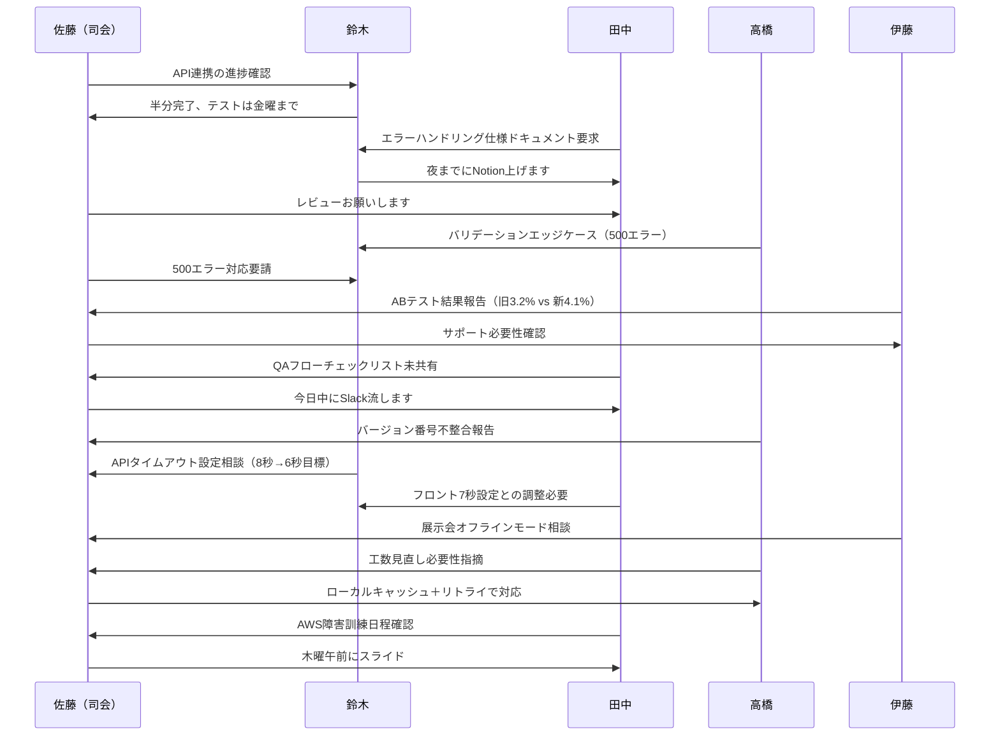
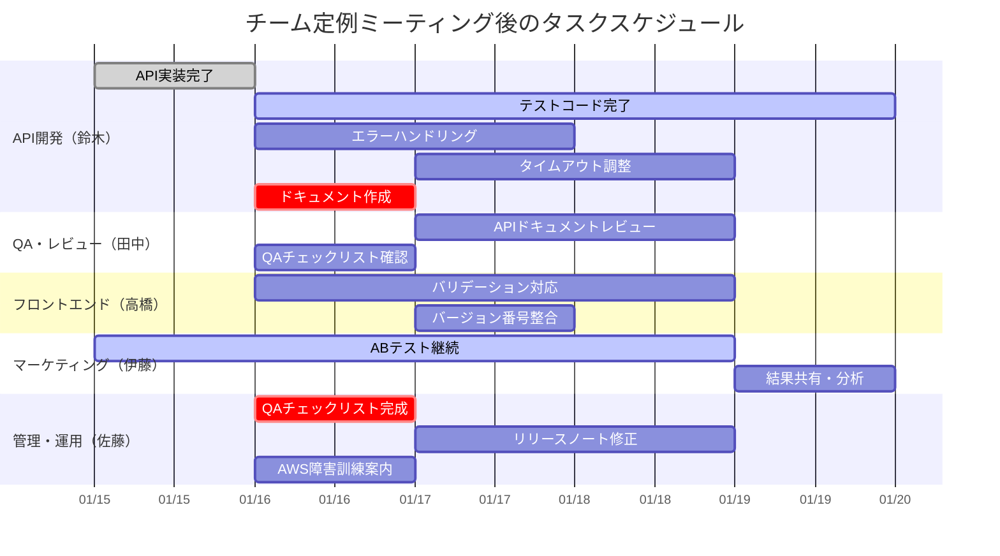
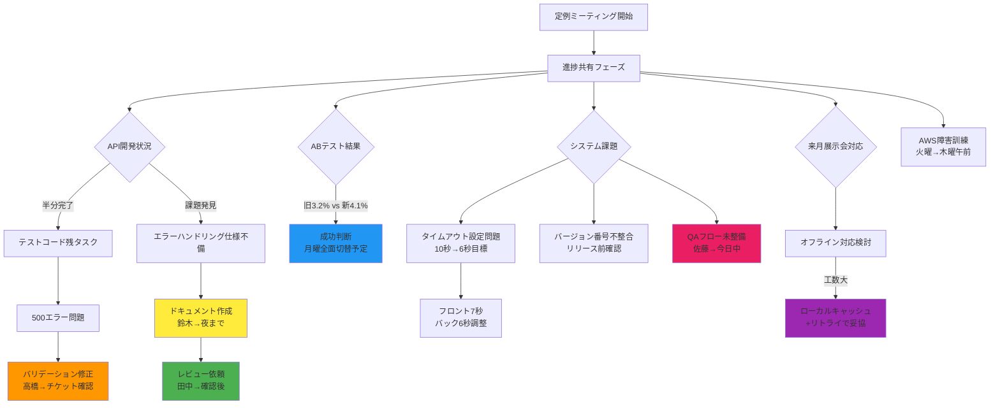
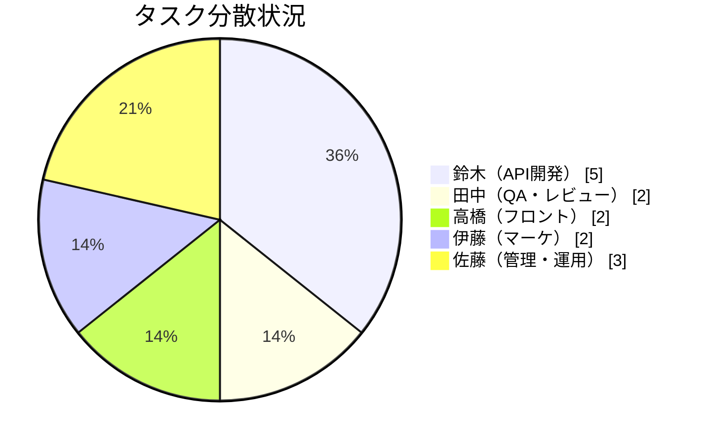
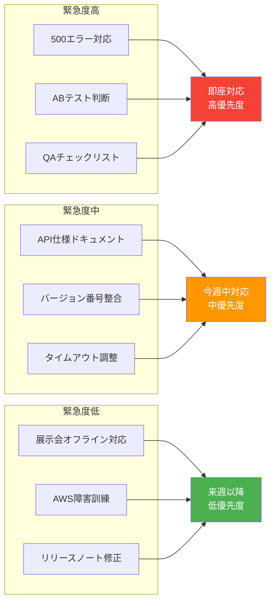

# チーム定例ミーティング 可視化ドキュメント

## ミーティング概要
- **参加者**: 佐藤（司会）、鈴木、田中、高橋、伊藤
- **内容**: 先週タスク進捗共有、課題整理、来週のタスク確認

---

# 議事録（フォーマット版）

### 1. 会議の基本情報
• 会議名: チーム定例ミーティング
• 開催日時: （記録なし - 要確認）
• 開催場所 / 形式: オンライン（音声確認から判断）
• 参加者: 佐藤（司会）、鈴木、田中、高橋、伊藤

### 2. 会議の目的
先週のタスク進捗共有と来週のアクション確認、課題の整理と対応方針の決定

### 3. 議題と議論内容
• 議題 1: API連携の進捗確認
  - 主な発言・決定事項: 鈴木より半分実装完了報告、テストコードは金曜まで、エラーハンドリング仕様ドキュメントを夜までにNotionに上げる、田中がレビュー担当

• 議題 2: システム不具合対応
  - 主な発言・決定事項: フロントのバリデーションで500エラー発生、鈴木が確認対応、バージョン番号の実装・ドキュメント間不整合をリリース前に修正

• 議題 3: マーケティングABテスト結果
  - 主な発言・決定事項: 旧版3.2%、新版4.1%のコンバージョン率、土日まで継続し月曜に全面切替判断

• 議題 4: QAプロセス整備
  - 主な発言・決定事項: QAフローチェックリストが未共有、佐藤が今日中にSlack投稿

• 議題 5: パフォーマンス調整
  - 主な発言・決定事項: APIタイムアウト10秒から6秒目標に変更、フロント側7秒設定との整合性確保

• 議題 6: 展示会対応
  - 主な発言・決定事項: オフライン機能は工数大のため、ローカルキャッシュ + リトライ機能で代替

• 議題 7: 運用関連
  - 主な発言・決定事項: AWS障害訓練を火曜夕方から木曜午前にスライド

### 4. その他特記事項
• APIのリトライログ増加に伴うメトリクス分離対応が必要
• 負荷テストで8秒弱のケースが発生、性能チューニング要検討

### 5. 次のアクション
• 鈴木: API実装完了とテストコード作成 — 金曜まで
• 鈴木: エラーハンドリング仕様とタイムアウト調整 — 今週中
• 田中: APIドキュメントレビューとQAチェックリスト確認 — ドキュメント完成後
• 高橋: フロントバリデーション対応とバージョン番号整合 — 今週中
• 伊藤: ABテスト継続と結果共有 — 土日まで継続、月曜判断
• 佐藤: QAチェックリスト完成とリリースノート修正 — 今日中〜今週中
• 佐藤: AWS障害訓練案内配信 — 今夜

### 6. まとめ
このミーティングでは複数の技術的課題と進捗管理項目が整理され、各メンバーに明確なアクションが割り当てられました。特に500エラーの対応とABテストの判断が最優先事項として位置づけられています。

---

# 可視化図表

## 1. ミーティングの流れ（シーケンス図）

## 2. タスク管理（ガントチャート）

## 3. 課題・タスクマップ（フローチャート）

## 4. 責任者別アクション（円グラフ）

## 5. 重要度・緊急度マトリクス

