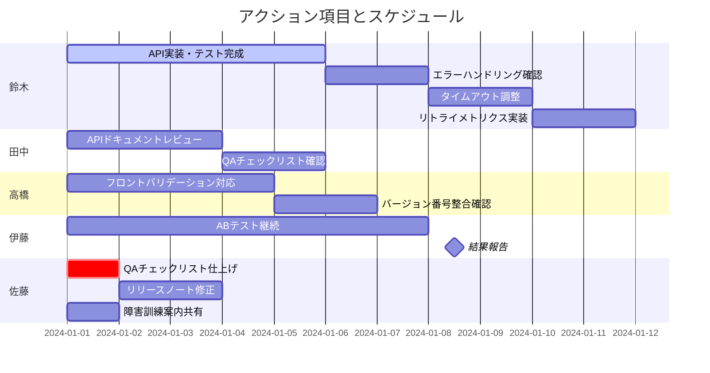
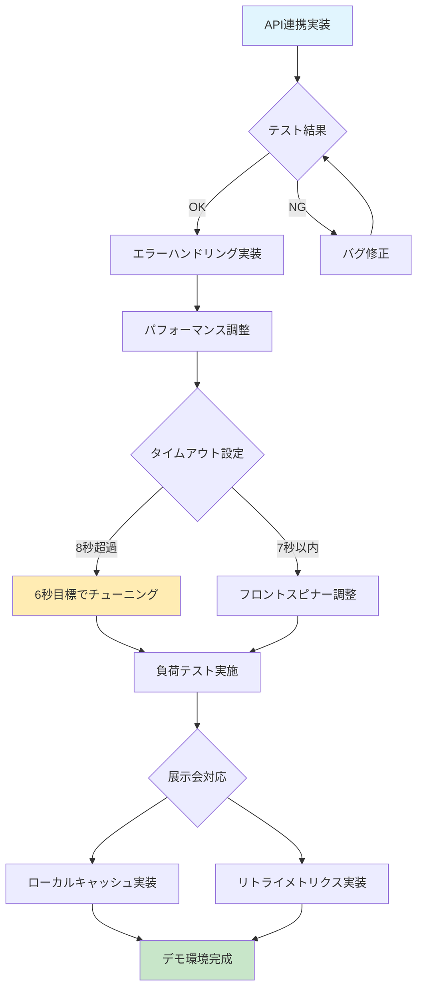
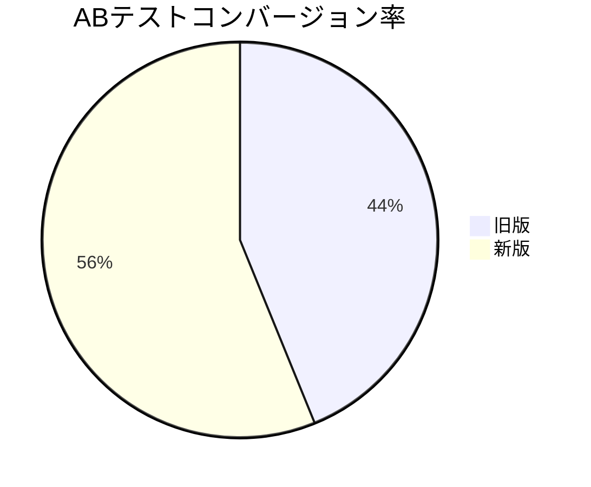
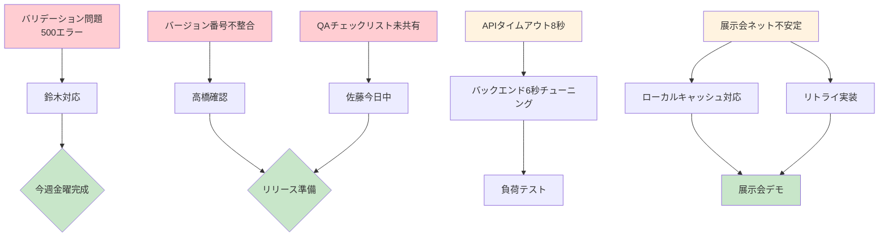

### 1. 会議の基本情報
• 会議名: 定例ミーティング
• 開催日時: 要確認（今日開催）
• 開催場所 / 形式: オンライン（音声会議）
• 参加者: 佐藤、鈴木、田中、高橋、伊藤

---

### 2. 会議の目的
先週のタスク進捗共有と課題解決、今後のアクション決め

---

### 3. 議題と議論内容
• 議題1: API連携実装の進捗
  - 主な発言・決定事項: 新しいAPI連携の実装が半分完了、テストコードは金曜までに完成予定。エラーハンドリング仕様のドキュメントをNotionに夜までに上げる

• 議題2: フロント側のバリデーション問題
  - 主な発言・決定事項: 入力値がnullの時にサーバ側で500エラーが返る問題を確認。鈴木さんが対応を確認予定

• 議題3: マーケティング・ABテスト
  - 主な発言・決定事項: キャンペーンLPのABテスト実施中。旧版3.2%、新版4.1%のコンバージョン率。土日まで継続し、優位差が出れば月曜に全面切り替え

• 議題4: QAフロー・チェックリスト
  - 主な発言・決定事項: 先週決定したQAフローのチェックリストがまだ共有されていない。佐藤さんが今日中にSlack流す

• 議題5: リリース準備
  - 主な発言・決定事項: バージョン番号がドキュメントと実装で食い違い。タグ付け前に確認が必要

• 議題6: APIパフォーマンス調整
  - 主な発言・決定事項: APIタイムアウトが10秒設定だが、負荷テストで8秒弱かかるケースあり。フロントは7秒でスピナー外すため、バックエンドを6秒目標にチューニング、最悪8秒に収める

• 議題7: 展示会デモ環境対応
  - 主な発言・決定事項: 来月の展示会でネット回線不安定の可能性。オフラインモードは工数的に厳しいため、ローカルキャッシュ＋リトライで対応。APIでもリトライのメトリクス分けを実装

• 議題8: AWS障害訓練
  - 主な発言・決定事項: 当初火曜夕方予定だった訓練を木曜午前にスライド。正式案内は今夜送付予定

---

### 4. その他特記事項
（特になし）

---

### 5. 次のアクション
• 鈴木: API実装＋テスト完成、エラーハンドリング確認、タイムアウト調整、リトライメトリクス実装 — 金曜まで
• 田中: APIドキュメントレビュー、QAチェックリスト確認 — 要確認
• 高橋: フロントのバリデーション対応、バージョン番号整合確認 — 要確認
• 伊藤: ABテスト継続、結果共有 — 土日まで、月曜に結果報告
• 佐藤: QAチェックリスト仕上げ、リリースノート修正、障害訓練案内共有 — 今日中（チェックリスト）

---

## 6. 図表による要点整理

### アクションスケジュール

### API関連課題の対応フロー

### ABテスト結果比較

### 課題の優先度と関連性
